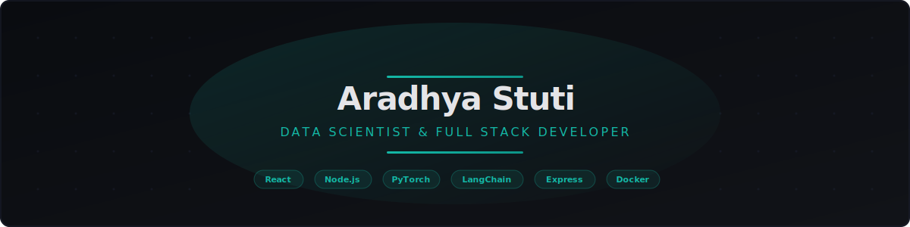

<p align="center">
  
</p>

<h1 align="center">Aradhya Stuti — Portfolio</h1>

<p align="center">
  Data Scientist & Full Stack Developer<br/>
  <strong>Deep Learning | Computer Vision | RAG Systems | Production Web Apps</strong>
</p>

<p align="center">
  <a href="https://github.com/AradhyaStuti"></a>
  <a href="https://www.linkedin.com/in/aradhya-stuti"></a>
  <a href="mailto:aradhya.mutants@gmail.com"></a>
</p>

---

## Tech Stack

| Layer | Technologies |
|-------|-------------|
| **Frontend** | React, Vite, Tailwind CSS, React Router |
| **Backend** | Node.js, Express 5 |
| **Email** | EmailJS (client-side, no server credentials) |
| **Styling** | Custom dark theme, scroll animations, spotlight effects |
| **Deployment** | Production-ready static build served via Express |

## Features

- Dark-themed responsive UI with scroll reveal animations and card spotlight effects
- Animated hero section with typewriter rotating roles
- Filterable project gallery (Web / AI / ML) with detailed project pages
- Contact form powered by EmailJS with auto-reply to sender
- Resume PDF download via server endpoint
- Visitor page-view tracking
- Mobile-first with hamburger nav and smooth page transitions

## Projects Showcased

| Project | Category | Highlights |
|---------|----------|------------|
| **Depression Risk Predictor** | ML | PyTorch neural network, F1: 87.15%, SHAP explainability |
| **InferaMind AI** | AI | RAG tutoring system, LangGraph, FAISS vector search |
| **MeetSync** | Web | WebRTC video conferencing, AES-256 encrypted chat, 247 tests |
| **GitForge** | Web | Code hosting platform, custom VCS, GraphQL + REST API |
| **PCB Defect Detection** | AI | ResNet-50 computer vision, 98.7% validation accuracy |

## Quick Start

```bash
# Install all dependencies
npm run install-all

# Run in development (server + client concurrently)
npm run dev
```

- Frontend: `http://localhost:3000`
- Backend API: `http://localhost:5000`

## Project Structure

```
portfolio/
├── client/                  # React frontend
│   ├── src/
│   │   ├── components/      # Navbar, Hero, Footer, FeaturedProjects
│   │   ├── pages/           # Home, About, Projects, ProjectDetail, Contact
│   │   ├── hooks/           # useReveal (scroll animations)
│   │   ├── App.jsx          # Router + transitions
│   │   └── index.css        # Full design system
│   └── vite.config.js
├── server/                  # Express backend
│   ├── routes/              # projects, contact, visitors
│   ├── config/              # data store, seed
│   ├── data/                # projects.json
│   └── server.js
├── resume.pdf
└── package.json
```

## API Endpoints

| Method | Route | Description |
|--------|-------|-------------|
| GET | `/api/resume` | Download resume PDF |
| GET | `/api/projects` | All projects (optional `?category=` filter) |
| GET | `/api/projects/:id` | Single project details |
| POST | `/api/contact` | Submit contact form |
| POST | `/api/visitors/track` | Track page visit |

## Scripts

| Command | Description |
|---------|-------------|
| `npm run dev` | Start server + client concurrently |
| `npm run server` | Start Express server only |
| `npm run client` | Start Vite dev server only |
| `npm run build` | Build React app for production |
| `npm start` | Start production server |

---

<p align="center">Built with React, Node.js, and Express</p>
